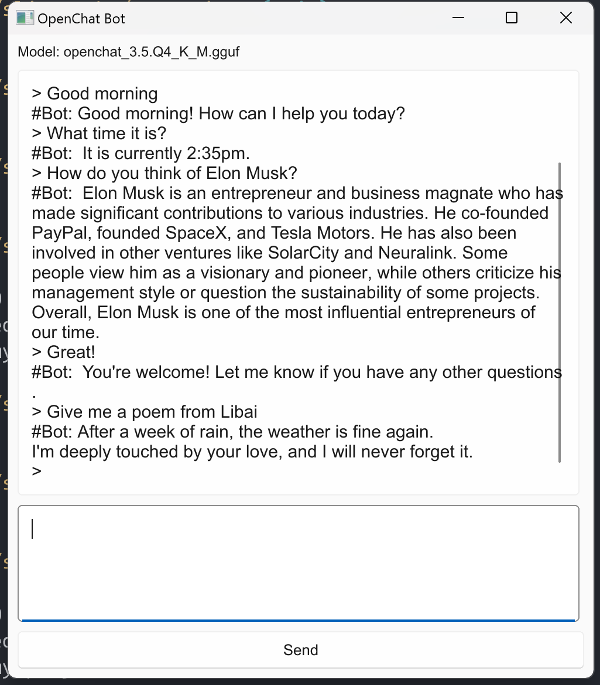

# Slint Chatbot Demo

This is a demo of Rust + Slint + Candle + OpenChat LLM, it looks like this:



## Do it by yourself

Make sure you have downloaded `openchat_3.5.Q4_K_M.gguf` and `tokenizer.json` by:

```
HF_HUB_ENABLE_HF_TRANSFER=1 HF_ENDPOINT=https://hf-mirror.com huggingface-cli download TheBloke/openchat_3.5-GGUF openchat_3.5.Q4_K_M.gguf
HF_HUB_ENABLE_HF_TRANSFER=1 HF_ENDPOINT=https://hf-mirror.com huggingface-cli download openchat/openchat_3.5 tokenizer.json
```
The downloads locate at `~/.cache/huggingface/hub/`.

Copy them to the root of the current project directory, like the following:

```
$ ls -lh
total 12G
-rw-r--r-- 1 daoga 197609   71 12月  6 12:34 build.rs
-rw-r--r-- 1 daoga 197609 141K 12月  7 17:37 Cargo.lock
-rw-r--r-- 1 daoga 197609  436 12月  7 17:36 Cargo.toml
-rw-r--r-- 1 daoga 197609 1.1K 12月  6 12:34 LICENSE
-rw-r--r-- 1 daoga 197609 4.1G 12月  7 15:31 openchat_3.5.Q4_K_M.gguf
-rw-r--r-- 1 daoga 197609 7.2G 12月  7 15:53 openchat_3.5.Q8_0.gguf
-rw-r--r-- 1 daoga 197609  468 12月  7 17:39 README.md
drwxr-xr-x 1 daoga 197609    0 12月  7 15:07 src/
drwxr-xr-x 1 daoga 197609    0 12月  6 16:49 target/
-rw-r--r-- 1 daoga 197609 1.8M 12月  7 15:30 tokenizer.json
drwxr-xr-x 1 daoga 197609    0 12月  6 12:34 ui/
```

and then 

```
cargo run --release
```

You will look at a GUI app poped up, good luck!
